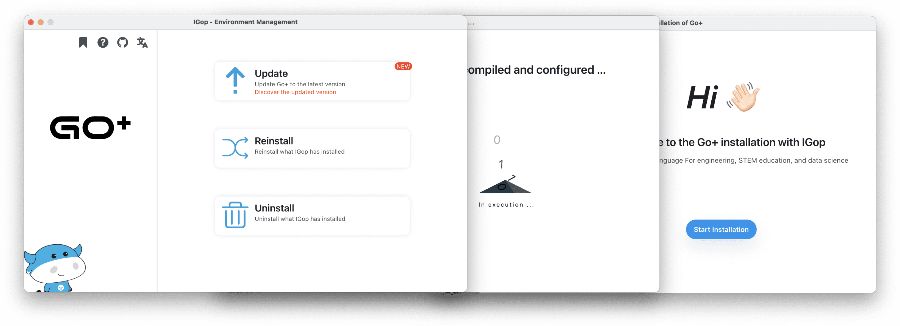

    

# IGop

::: tip Let's Go :point_down:
[Download IGop](https://ingop.uiuing.com/ingop-guide/igop/download)
:::

**Go+ Language Environment Management Client (cross-platform desktop application)**

**Features:**

- InGop provides a super simple GUI client for Go+ language dependency management/installation/updating/uninstallation.
- It can be installed to start learning and using the Go+ language even without basic computer knowledge.
- Internationalisation support (Chinese / English / more...).
